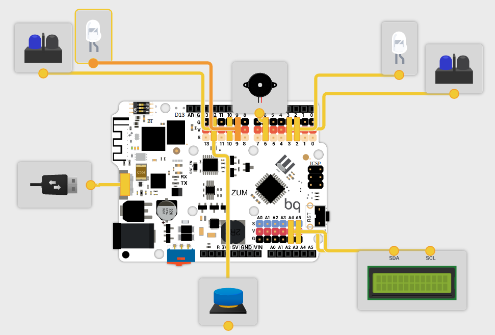

# Medida de cinemática

* 2 x [Sensores IR](http://www.electan.com/modulo-seguidor-linea-canales-tcrt5000-p-6507.html)
*  [LCD](http://www.electan.com/modulo-lcd-serie-conectar-listo-16x2-iluminacion-rgb-p-3043.html)
* [Pulsadores, Arduino,  Leds, Cables, placa de conexión](http://www.electan.com/arduino-uno-pack-con-kit-basico-arduino-p-3056.html)

* [Baterías](http://www.electan.com/power-bank-2600-mah-p-6508.html)

## Montaje

Usaremos el siguiente montaje:

## Programa

Se desarrolló un [programa Bitbloq](./Fisica.json) para hacer las medidas.

(El [programa Arduino](./Fisica.ino) equivalente)

### Funciones

### Configuración

### Bucle central

